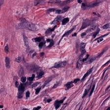
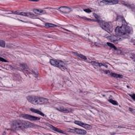
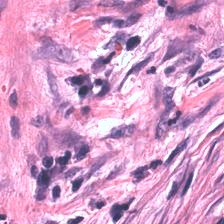
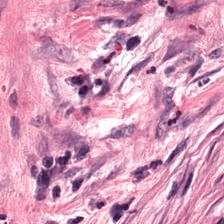
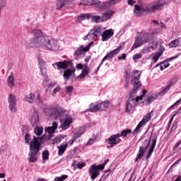
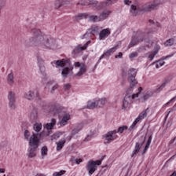
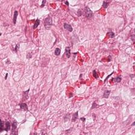
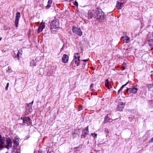
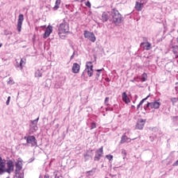
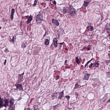

# WSI Normalizer: a color stain normalization tool/package for whole slide images

[](https://pypi.org/project/wsi-normalizer/)
[](https://pypi.org/project/wsi-normalizer/)

Inspired by & reconstructed from this repository [link](https://github.com/wanghao14/Stain_Normalization)

How to start? [blog](https://blog.csdn.net/CalvinTri/article/details/135429053)

## Description
Repository for normalizing whole slide images (WSI) patches.

### Updates
1. **[10/2024]** Thanks to Cédric Walker's [torchvahadane](https://github.com/cwlkr/torchvahadane)! We have added GPU(Cuda) support for [Vahadane](https://ieeexplore.ieee.org/abstract/document/7460968/) method. We can now boost up stain normalization speed by 2x+.
2. **[04/2025]** We have upload the [PyPI package](https://pypi.org/project/wsi-normalizer/) for this repository. You can directly install it by using pip and use it without clone the repository.

### Support for:
1. [Reinhard](https://ieeexplore.ieee.org/abstract/document/946629/) Reinhard, Erik, et al. "Color transfer between images." IEEE Computer graphics and applications 21.5 (2001): 34-41.
2. [Macenko](https://ieeexplore.ieee.org/abstract/document/5193250) Macenko, Marc, et al. "A method for normalizing histology slides for quantitative analysis." 2009 IEEE international symposium on biomedical imaging: from nano to macro. IEEE, 2009.
3. [Vahadane](https://ieeexplore.ieee.org/abstract/document/7460968/) Vahadane, Abhishek, et al. "Structure-preserving color normalization and sparse stain separation for histological images." IEEE transactions on medical imaging 35.8 (2016): 1962-1971.


## Package Usage

Install the package via PyPI:

```bash
pip install wsi-normalizer
```

Then you can use it in your code:

```python
import cv2
from wsi_normalizer import MacenkoNormalizer  # or ReinhardNormalizer, VahadaneNormalizer, TorchVahadaneNormalizer

def read_image(path):
    return cv2.cvtColor(cv2.imread(path), cv2.COLOR_BGR2RGB)

# Core function
macenko_normalizer = MacenkoNormalizer()
macenko_normalizer.fit(read_image('TARGET_IMAGE.jpg'))
norm_img = macenko_normalizer.transform(read_image('INPUT_IMAGE.jpg'))

cv2.imwrite('OUTPUT_IMAGE.jpg', cv2.cvtColor(norm_img, cv2.COLOR_RGB2BGR))
```

## Local Installation
1. run `pip install -r requirements.txt` for installing dependencies.

if you need the GPU support for Vahadane method, you need to additionally install the `pytorch-gpu`, `scipy`, `kornia (optional)`

2. make sure you have the following folder structure:
```
├── data
│   ├── slide_1
│   │   ├── patch_1.png
│   │   ├── patch_2.png
│   │   ├── ...
│   ├── slide_2
│   │   ├── patch_1.png
│   │   ├── patch_2.png
│   │   ├── ...
│   ├── ...
│   └── slide_n
│       ├── ...
│       └── patch_n.png
```

Note that png or jpg images are supported

3.  modify the following arguments: `<TARGET FOLDER> <OUTPUT FOLDER> <NORM METHOD> <TARGET IMAGE>`, and run:
```bash
python main.py --target_dir <TARGET FOLDER> --output_dir <OUTPUT FOLDER> --method <NORM METHOD> --target_img <TARGET IMAGE>
```

make sure the `<NORM METHOD>` is in **reinhard**, **macenko**, **vahadane**, **vahadane-gpu**

Please note that **vahadane-gpu** is more suitable for high resolution image normalization, e.g. 1024x1024. Considering the CPU-GPU data transfer cost.

4. each slide will be normalized and saved in the output folder with the same name as the original slide, with a suffix of `.jpg`.

5. I also provide a sample script and corresponding images in this repository, simply run:
```bash
python main.py --target_dir eg/origin --output_dir eg/norm --method vahadane-gpu --target_img eg/standard.jpg
```
here, I use vahadane as norm method, and use standard.jpg as target image

The 3 methods' results are shown below:

|                       Original                        |            Standard (target)            |                     Reinhard                      |                     Macenko                      |                     Vahadane                      |                     Vahadane-GPU                      |
|:-----------------------------------------------------:|:---------------------------------------:|:-------------------------------------------------:|:------------------------------------------------:|:-------------------------------------------------:|------------------------------------------------------:|
|  |  |  |  |  |  |
|  |  |  |              |  |  |
